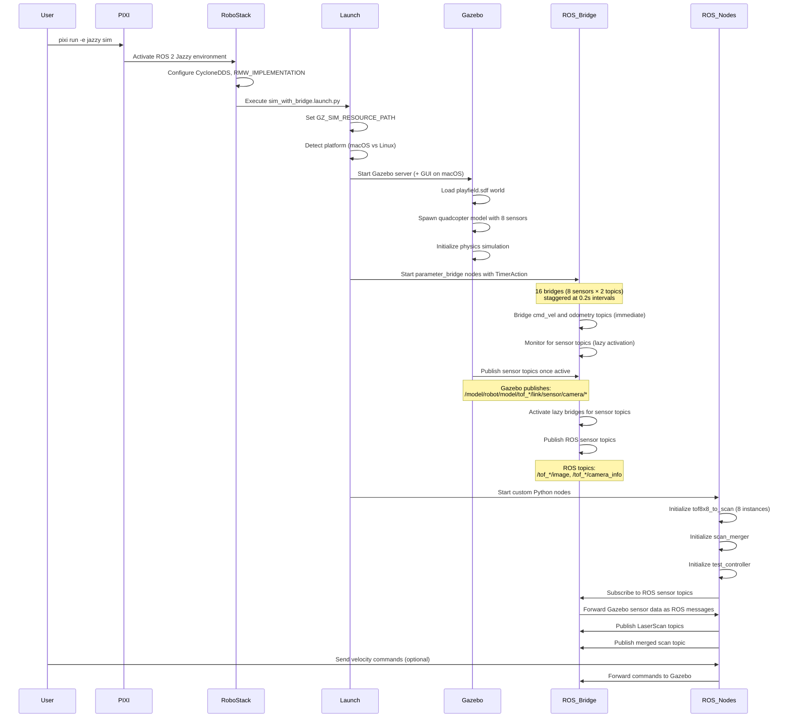

# Gazebo SLAM Prototype

Run simulation of SAFMC drone with ring of 8 ToF sensors using PX4 Software in the Loop (SITL)

## Quick Start

### Prerequisites

- [Pixi](https://pixi.sh/) package manager
- Git

### Setup

1. **Clone the repository:**
   ```bash
   git clone <repository-url>
   cd gazebo-slam-prototype
   ```

2. **Install dependencies and build:**
   ```bash
   # This automatically sets up ROS 2 Jazzy and all dependencies
   pixi run -e jazzy build
   ```

3. **Activate the environment:**
   ```bash
   pixi shell -e jazzy
   # ROS 2 environment is ready with CycloneDDS configured automatically
   ```

### Usage

Once in the pixi shell, you can:

**Launch the PX4 SITL environment:**
   ```bash
   pixi run -e jazzy px4_sitl
   ```

**Viewing ROS topics**
The list of ROS topics created by the SITL simulation can be viewed using 
```bash 
ros2 topic list
```
Data from individual ToF sensors are published to the /depth/tof_n topics. However, the launch file also automatically starts up the tof_to_scan.py node, which automatically processes the depth data and returns a LaserScan topic, /scan_merged that can be used by ROS SLAM toolbox.

Other data (e.g. odometry) from the PX4's Flight Management Unit (FMU) can also be subscribed to via their respective ROS topics. 

## Project Overview

This project uses [RoboStack](https://robostack.github.io/) - a conda-based ROS distribution that integrates seamlessly with pixi for reproducible ROS 2 development environments.

### Key Features

- **8× VL53L7CX ToF sensor simulation** using depth cameras
- **15 cm × 15 cm quadcopter model** with sensor array
- **20 m × 20 m competition playfield** with obstacles
- **ROS 2 bridge** for sensor data integration
- **Depth to LaserScan conversion** and 360° scan merging
- **SLAM validation** using slam_toolbox

### Architecture

The simulation stack includes:
- **Gazebo Harmonic** for physics simulation
- **ROS 2 Jazzy** for robotics middleware
- **ros_gz_bridge** for ROS-Gazebo communication
- **slam_toolbox** for mapping and localization
- **Custom Python nodes** for sensor processing

### System Initialization Sequence



### Package Structure

```
tof_slam_sim/
├── models/           # Gazebo model definitions
│   ├── vl53l7cx/     # ToF sensor model
│   ├── quadcopter/   # Drone with 8 sensors
│   ├── walls/        # Environment obstacles
├── worlds/           # Gazebo world definitions
├── launch/           # ROS 2 launch files
├── src/              # Python nodes
│   ├── tof8x8_to_scan.py    # Depth → LaserScan
│   ├── scan_merger.py       # 360° scan merging
│   └── test_controller.py   # Robot controller
└── config/           # Configuration files
```

## Development

### Environment Management

The project uses pixi for environment management. Key commands:

```bash
# Enter the ROS environment
pixi shell -e jazzy

# Run commands in the environment
pixi run -e jazzy <command>

# Update dependencies
pixi update

# Clean build artifacts
pixi run -e jazzy clean
```

### Building

The build system installs directly into the pixi environment (`.pixi/envs/jazzy/`), eliminating the need for traditional ROS workspace sourcing.

```bash
# Build the package
pixi run -e jazzy build

# The package is automatically available in the ROS environment
```

### Why RoboStack + Pixi?

- **Reproducible**: Lock files ensure consistent environments
- **Cross-platform**: Works on macOS, Linux, and Windows
- **Isolated**: No conflicts with system packages
- **Simple**: One-command setup and activation
- **Fast**: Incremental builds and caching
- **DDS-Ready**: Automatically configured with CycloneDDS (prevents FastDDS hanging)

## Troubleshooting

### Common Issues

1. **ROS commands not found**: Make sure you're in the pixi shell
   ```bash
   pixi shell -e jazzy
   ```

2. **Build fails**: Clean and rebuild
   ```bash
   pixi run -e jazzy rebuild
   ```

3. **Gazebo issues**: Ensure graphics drivers support OpenGL
   ```bash
   # On macOS, you might need:
   export LIBGL_ALWAYS_SOFTWARE=1
   ```

### Getting Help

- Check the [RoboStack documentation](https://robostack.github.io/)
- Review the package-specific README in `tof_slam_sim/`
- Open an issue for bugs or feature requests

## License

Apache 2.0
